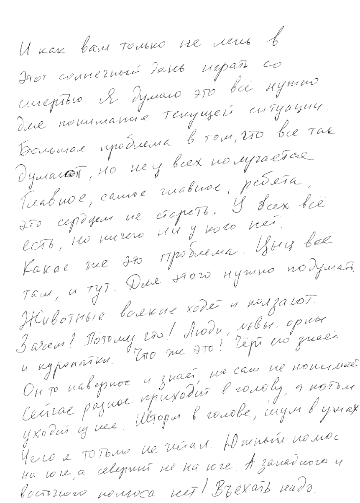
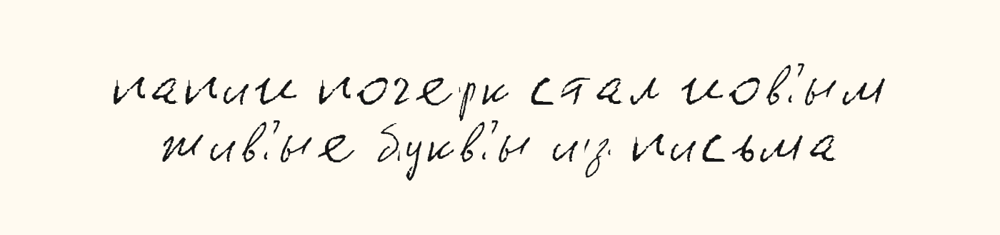

# Dad Handwriting Font Builder

A local web app that turns a scanned handwriting page into a TrueType font.
Tesseract proposes character boxes, you correct them over the scan, and a second
workspace normalizes glyph size, baseline, spacing, and ink thickness.





The included Russian sheet and `DadHandwriting.ttf` are a real worked example made
from my dad's handwriting, used here with permission.

## Features

- PDF, PNG, and JPEG upload (up to 25 MB)
- Russian Tesseract OCR as an editable starting point
- Visual crop, relabel, add, disable, and delete tools
- Per-glyph size, baseline, advance-width, and stroke-thickness controls
- Shared-baseline glyph overview with zoom
- FontTools-based TTF generation and an in-browser preview
- Reproducible JSON files for crop selections and alignment settings

## Requirements

- Python 3.10+
- Poppler (`pdftoppm`)
- Tesseract with Russian language data
- Python packages from `requirements.txt`

On Debian/Ubuntu:

```bash
sudo apt install poppler-utils tesseract-ocr tesseract-ocr-rus
python3 -m venv .venv
source .venv/bin/activate
pip install -r requirements.txt
```

## Run

```bash
python3 font_ui.py
```

Open <http://127.0.0.1:8765>.

1. Use **Upload PDF/PNG** to choose a scan, or work with the included example.
2. In **Segmentation**, correct OCR labels and boxes. Shift-drag adds a box;
   Delete/Backspace removes the selected one.
3. In **Alignment**, compare glyphs against the red baseline and adjust size,
   vertical position, advance width, or ink thickness.
4. Click **Build TTF**, preview it, and download the result.

Uploading a new source resets the current crop and alignment JSON. Keep copies if
you want to retain several fonts.

## Command-line build

After selections have been saved in `glyph_samples.json`:

```bash
python3 handwriting_font.py
```

The generated font is written to `DadHandwriting.ttf`.

## Project files

- `handwriting_font.py` — rendering, OCR preparation, tracing, and TTF building
- `font_ui.py` — dependency-light localhost HTTP server and API
- `ui/index.html` — segmentation and alignment interface
- `glyph_samples.json` — corrected example selections
- `font_settings.json` — example alignment adjustments
- `Scanned Document.pdf` — included example source sheet

## Privacy

The app runs locally and does not send documents to a third-party service. The
browser communicates only with the localhost Python server.

## License

Code is released under the MIT License. The example handwriting scan, derived
glyph data, screenshots, and generated font are included for demonstration only
and are not licensed for redistribution outside this repository.
